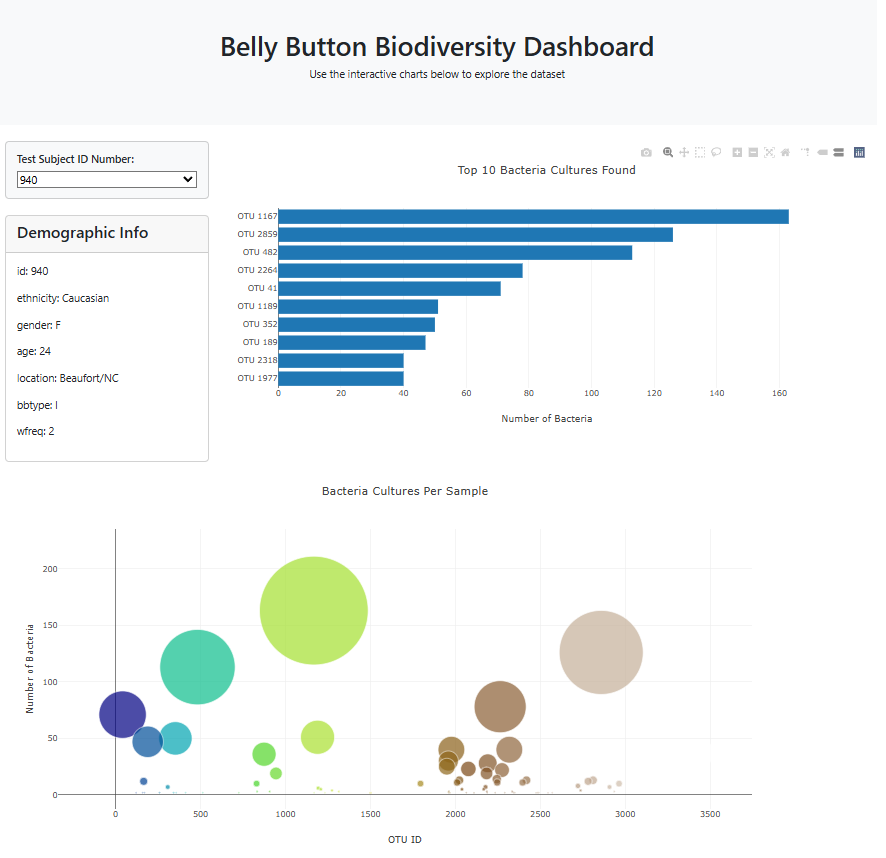
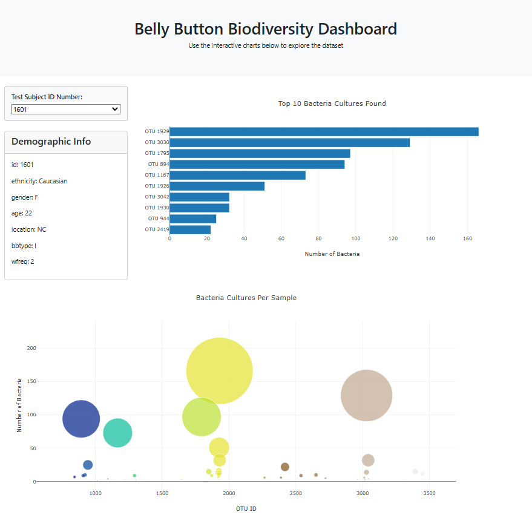

# 🧫 Belly Button Biodiversity Dashboard

Explore the world of microbes in human navels with this interactive dashboard! This project visualizes data from the Belly Button Biodiversity dataset, revealing the most common and rare bacterial species found in different individuals.

> 📊 Built with JavaScript, D3.js, and Plotly | 📦 Deployed via GitHub Pages

---

## 📑 Table of Contents

- [Project Overview](#project-overview)
- [Dataset](#dataset)
- [Features](#features)
- [Screenshots](#screenshots)
- [Deployment](#deployment)
- [References](#references)

---

## Project Overview

In this project, you'll find a dashboard that allows users to explore the Belly Button Biodiversity dataset, which catalogs the microbial species (Operational Taxonomic Units or OTUs) found in human navels. The dataset demonstrates that while a few bacterial types are highly common, the majority are rare.

---

## Dataset

The JSON dataset was retrieved from the following URL:
https://static.bc-edx.com/data/dl-1-2/m14/lms/starter/samples.json

It contains:
- **names**: Unique IDs for test subjects
- **metadata**: Demographic information for each individual
- **samples**: Microbial data including `otu_ids`, `otu_labels`, and `sample_values`

---

## Features

✅ **Dynamic Dropdown Menu**  
- Select a test subject to view their data

✅ **Bar Chart**  
- Shows top 10 bacterial cultures found per individual

✅ **Bubble Chart**  
- Displays all detected bacterial cultures and their prevalence

✅ **Demographic Panel**  
- Lists metadata such as age, gender, and washing frequency

✅ **Interactivity**  
- All charts and data update based on selected sample

✅ **Responsive Layout**  
- Built with Bootstrap 5 for a clean, responsive UI

---

## Screenshots

### ID 940

### ID 1601

---

## Deployment

You can try out the interactive dashboard live here:  
🌐 [GitHub Pages Link](https://your-github-username.github.io/belly-button-biodiversity/)  
*(Replace with your actual deployed link)*

Or check out the full project code on GitHub:  
🔗 [GitHub Repository](https://github.com/your-github-username/belly-button-biodiversity)  
*(Replace with your actual repo link)*

---

## References

- Dataset provided by edX Boot Camps LLC.
- JavaScript visualization powered by [Plotly.js](https://plotly.com/javascript/) and [D3.js](https://d3js.org/)
- Project assistance and README formatting support by [ChatGPT](https://openai.com/chatgpt)